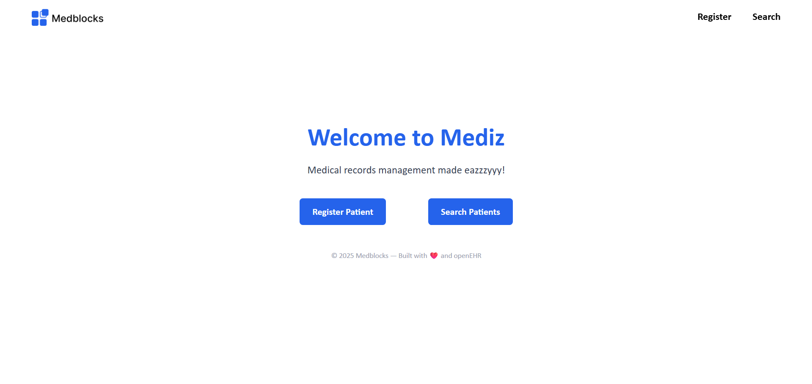
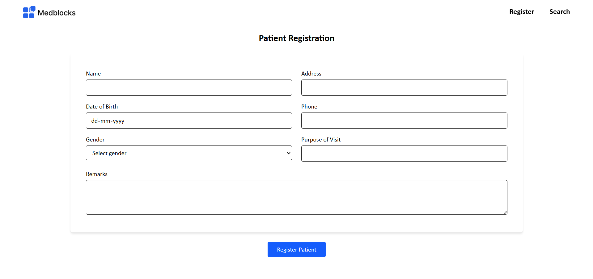
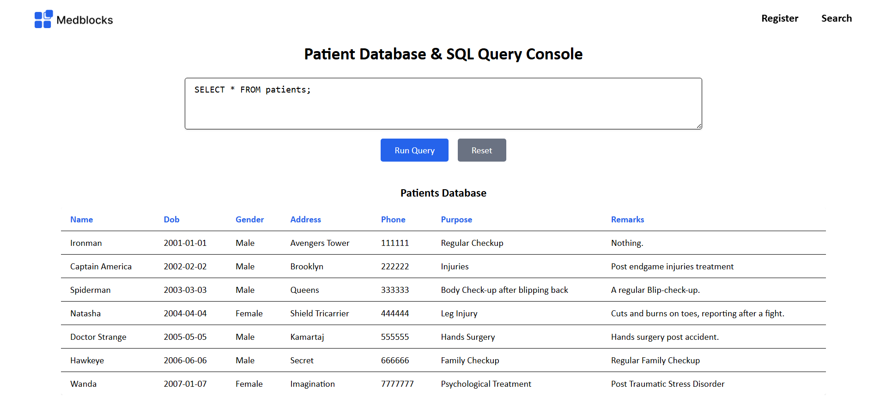

# Mediz
Medblocks - Medical records management made eazzzyyy!
---
A lightweight, local-first React + Vite app to manage patient registrations and run SQL queries using **ElectricSQL** and **PGlite**. Built with ❤️ for modern healthcare workflows.


# Requirements Summary
## Features

- **Frontend-only app** – No backend servers.
- **Pglite** - for data storage.

### Core Features

- Register new patients.
- Query patient records using raw SQL.
- Persist data across page refreshes.
- Work across multiple tabs with synchronized reads/writes.
- Clean git commit history (one feature per commit).
- Deploy using Vercel or Netlify.

### Documentation

- Setup & usage instructions.
- Challenges faced during development.

### 🔧 Tech Stack

- **Frontend:** React + TypeScript
- **Styling:** Tailwind CSS
- **Database:** Pglite
- **State sync:** Pglite Worker + Live

## Setup - Installation
```
npm create vite@latest mediz-app -- --template react-ts
cd mediz-app
npm install
npm install tailwindcss @tailwindcss/vite
# See: https://tailwindcss.com/docs/installation/using-vite
npm install @electric-sql/pglite
# See: https://pglite.dev/docs/
npm install react-router-dom
# pglite error: https://pglite.dev/docs/bundler-support
npm run dev
```

### Database Schema
**Patient** - `Table`
```
- Name
- Date of Birth
- Gender
- Address
- Phone Number
- Purpose
- Remarks
```

## Project Structure
```
/src
  /components
    Navbar.tsx
    PatientForm.tsx
    SearchPage.tsx
  /lib
    db.ts                 <- Pglite initialization
    db-worker.ts          <- Pglite worker
  App.tsx
  index.tsx
/public
  index.html
README.md
Notes.md
```

## Landing Page


## Register Patient Page


The registration page allows clinic staff or health workers to add new patients to the system quickly and efficiently.
- Storage:
  - Upon submission, patient data is stored locally in a SQLite (PGlite) database, with automatic schema creation.
- Live Sync:
  - Newly added patients automatically appear in the search tab (in real-time, across tabs).

Technical Highlights:
- Uses useState to manage form inputs
- On submit, executes SQL INSERT INTO patients (...) directly on the embedded database
- Automatic clearing of form and confirmation message on success
- Uses ElectricSQL’s leader-based schema initialization for consistent setup

## Search Page

The Search Page provides a dual-purpose interface for:
- Viewing the complete patient database in real-time (live sync).
- Running custom SQL queries via an interactive console.
This page showcases the power of using PGlite with live queries, allowing a fully local, reactive experience — all in the browser.
`Real-time updates using live.query()`

## Database - PGlite
The app uses **PGlite**, a WebAssembly-powered version of SQLite, provided by the @electric-sql/pglite package. This allows full SQL functionality directly in the browser — with no server backend required.

### Storage: IndexedDB
The app uses PGlite, a WebAssembly-powered version of SQLite, provided by the @electric-sql/pglite package. This allows full SQL functionality directly in the browser — with no server backend required. 
- `dataDir: "idb://mediz-patient-db"`
- The database is saved in the browser’s persistent storage.
- Data is retained across page reloads, browser restarts, and can be shared across tabs.
- Multiple tabs connect to the same local database.

### Initialization
The database is initialized in lib/db.ts using a Web Worker to offload processing from the main UI thread:
```
export const db = new PGliteWorker(
  new Worker(new URL("./db-worker.ts", import.meta.url), { type: "module" }),
  {
    dataDir: "idb://mediz-patient-db",
    extensions: { live },
  }
);
```
This uses PGliteWorker from @electric-sql/pglite/worker, allowing the database to be run inside a Web Worker — keeping the UI responsive even during heavy database operations.

### Leader Election
To prevent multiple tabs from initializing or modifying the schema at the same time, the app uses automatic leader election:
```
if (await db.isLeader) {
  await db.exec(`
    CREATE TABLE IF NOT EXISTS patients (...);
  `);
}
```
Only the elected leader tab runs this logic, avoiding conflicts or duplication in the shared IndexedDB store.
Leader election is automatically handled under the hood using BroadcastChannel, so tabs can communicate and determine a single leader.

### Live Query 
Thanks to the live extension, the app supports live queries using db.live.query(...):
```
const result = await db.live.query(
  'SELECT * FROM patients ORDER BY id DESC;',
  [],
  (res) => {
    setPatients(res.rows);
  }
);
```
This provides real-time reactivity across tabs. For example:
- When a patient is registered in one tab...
- The change is immediately reflected in the search view in another tab...
- Without a page reload or manual refresh.

### ✅ Summary
- Database: SQLite via PGlite (WebAssembly)
- Persistence: IndexedDB (via dataDir)
- Reactivity: live.query() for automatic sync
- Coordination: Leader election using isLeader
- Isolation: DB logic runs in a Web Worker
- No backend needed — completely local-first

-- Thank You! -dp